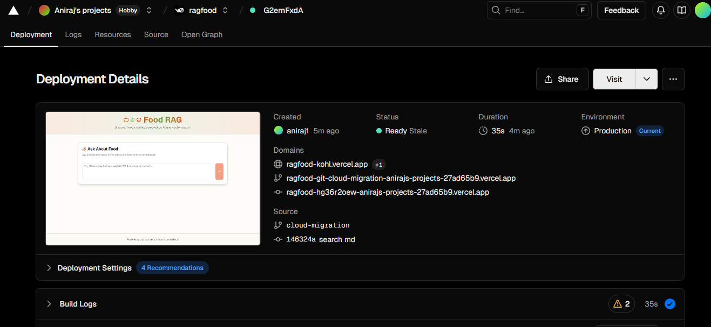
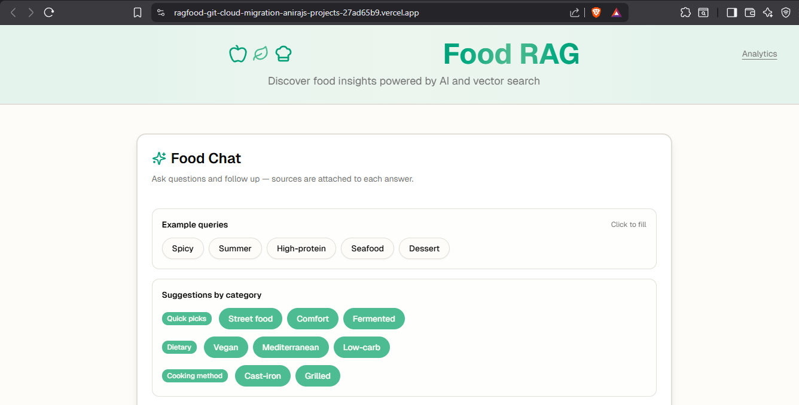
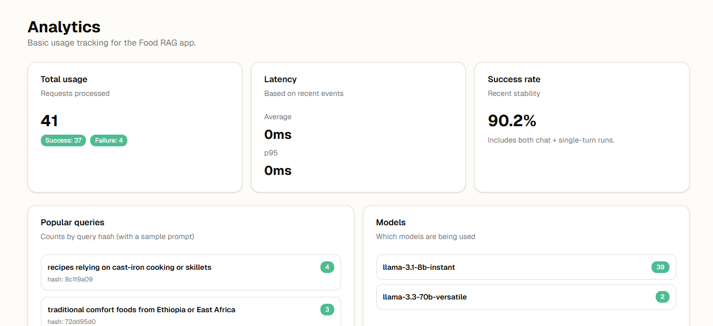

# v0.dev Workflow Evidence (Week 4)

This document captures how v0.dev was used during development and what was modified afterward.

- Deployment 

- Website

- Analytics

- Link: https://ragfood-git-cloud-migration-anirajs-projects-27ad65b9.vercel.app/

## What v0 Generated

- **Generated components/pages**:
  - (e.g., chat UI skeleton, layout, cards, buttons)
- **Primary prompt(s) used in v0.dev**:
  - Prompt 1: _<paste prompt text>_
  - Prompt 2: _<paste prompt text>_
- **v0 share link(s) (if available)**:
  - _<paste share link>_

## What Was Changed After Generation

- **Functional changes**
  - Added server actions for RAG (`ragQuery`, `ragChat`) and streaming.
  - Integrated Upstash Vector retrieval and Groq chat completions.
  - Added multi-turn transcript and model selection.
  - Added analytics events + dashboard.

- **UX and polish**
  - Added sources toggle per assistant message.
  - Added example queries + suggestion chips.
  - Added copy/share actions.
  - Minty theme tuning via CSS variables.

## Evidence Checklist

- [ ] Screenshot of v0.dev prompt(s)
- [ ] Screenshot of v0-generated preview
- [ ] Screenshot(s) of final deployed UI (chat + sources)
- [ ] Screenshot(s) of analytics dashboard (`/analytics`)
- [ ] Link to deployed app (Vercel)

## Repo Pointers

- UI: `components/chat-interface.tsx`
- Server actions: `app/actions.ts`
- Analytics: `lib/analytics.ts`, `app/analytics/page.tsx`, `app/api/analytics/route.ts`
